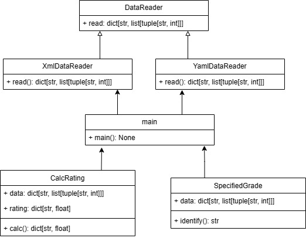

# Лабораторная 1 по дисциплине "Технологии программирования"

## Вариант 5

**Формат входного файла**: YAML

**Расчетная процедура**: Определить и вывести на экран студента, имеющего 76 
баллов минимум по трем дисциплинам. Если таких 
студентов несколько, нужно вывести любого из них. Если 
таких студентов нет, необходимо вывести сообщение об 
их отсутствии.

## Используемые технологии:
**Язык программирования:** Python

**Тесты:** Pytest

**Линтер:** Pycodestyle

**Работа с YAML-файлами**: Pyyaml

## Диаграмма классов:
